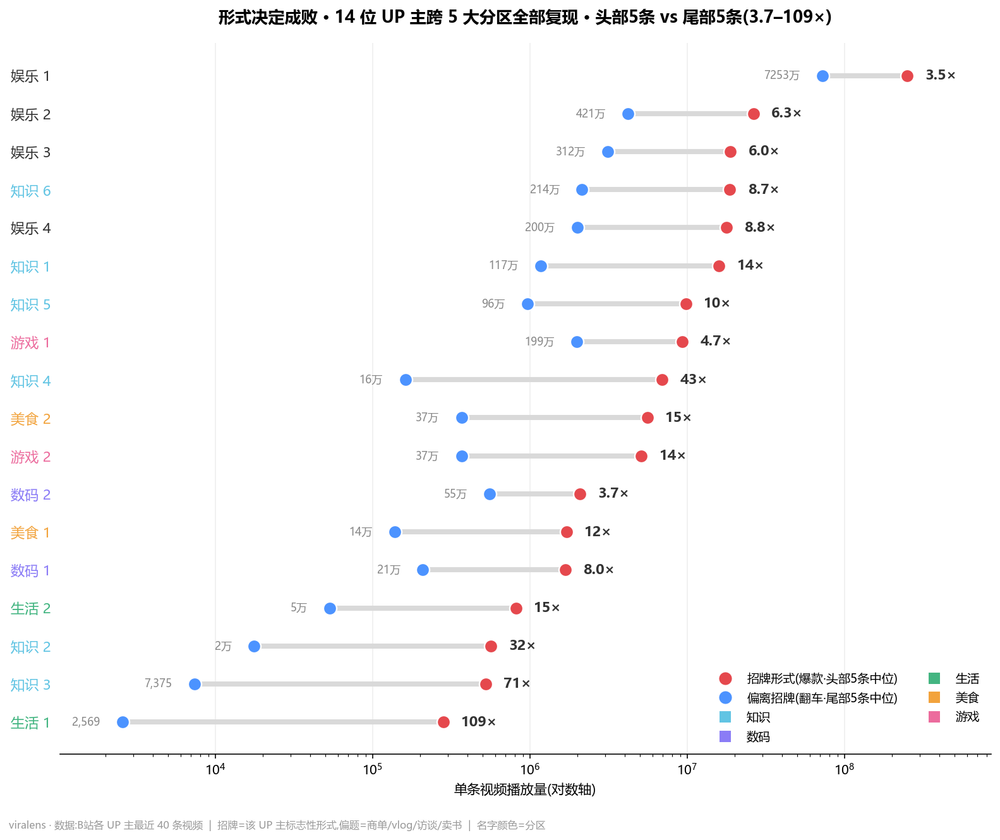
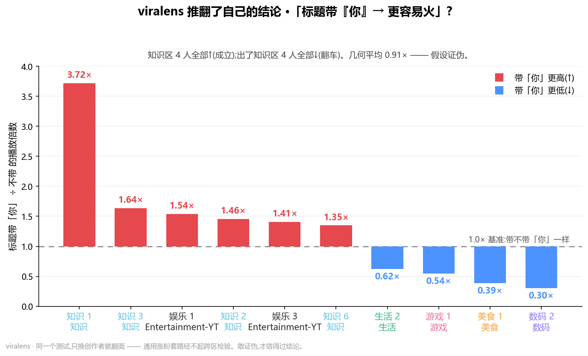

<div align="center">


[](LICENSE)
&nbsp;
&nbsp;
&nbsp;

**Point it at any creators on Bilibili or YouTube — one command pulls their video data for you.**

List who you care about in one config file; viralens auto-calls the official APIs and hands you the data.
`python viralens.py` gives you a clean **CSV + JSON** (open it in Excel, or feed it to your own analysis).
Want more than the raw numbers? `python viralens.py --report` runs a full analysis on top and emits an
interactive report.

And the analysis half isn't a black box — it's **hypothesis-driven**: every finding has to survive
**cross-creator, cross-zone validation** before it's allowed to stay, and we publish the dead ends on
purpose, including a "growth hack" **we ourselves believed**, until we tested it one zone wider and it flipped.

[ English ] · [中文简介](#-中文简介)

</div>

---

## What the analysis found: the one signal that held up in *every* zone

Across **14 Bilibili creators · 5 zones · 549 videos**, the same creator's
**top-5 vs bottom-5** videos differ by **3.7× to 109×** in plays.

That gap isn't topic, luck, or thumbnail. It's **whether the video sits inside the creator's
signature form.** Step outside it — sponsored reads, vlogs, interviews, livestream re-uploads —
and the video craters. We first saw it in the knowledge zone; then we re-ran the *identical* test
in tech, daily-life, food, and gaming. **It held in all five.**



> **You're a ceiling inside your signature form, and you crater the moment you leave it (3.7–109×) —
> *unless* you make the off-format content to signature-grade quality too.**

Two exceptions sharpen the rule rather than break it:

| Exception | Plays | Why it still fits |
|---|---|---|
| A tech/film creator — a *sponsored* video | 9.8M (a hit) | The ad was produced to the same signature standard as their normal work. |
| A knowledge creator — a livestream re-upload | 17.6K (a flop) | Below-signature *production*, not below-signature *topic*. |

So the lever isn't "never take a brand deal." It's **never ship below your signature bar.**

---

## What makes this trustworthy: we kill our own hypotheses

Earlier we reported a clean "universal lever": **titles that address the viewer as 「你」(you) get
more plays.** Across 6 knowledge creators it was **4-for-4**, averaging 1.86×. So we wrote it down.

Then we ran the *same test* across all five zones — and it **flipped**:



4 up, 4 down, geometric mean **0.91×**. In tech / food / gaming, addressing "you" correlated with
*lower* plays (a tech creator 0.30×, a food creator 0.39×, a gaming creator 0.54×). `「你」` is a *knowledge-explainer* hook
("let me explain this to **you**"), not a universal trick. **We retracted it.** It's the third
hypothesis this project has killed — and the first one we killed was *our own*.

**The stronger conclusion that emerged:** pushed across 14 creators, nearly every title/cover
"trick" collapses into *creator-specific* — numbers (7↑/5↓), exclamation marks (4↑/5↓), question
marks (4↑/6↓), cover colorfulness / brightness (mean ρ ≈ −0.04). The cover "busyness" metric even
points *opposite* ways for two creators (−0.55 vs +0.52 — same ruler, reversed sign).
**The only structural signal that survives every zone is: stay inside *your own* signature form.**

Every claim here carries one of three verdicts: ✅ supported · ❌ falsified · 〰️ inconclusive.

| Hypothesis | Verdict |
|---|---|
| Form sets the ceiling; off-format craters | ✅ supported — held across 14 Bilibili + 4 English-YouTube creators / 6 zones (3.5–109×) |
| Titles addressing 「你」→ more plays *(our own earlier claim)* | ❌ falsified — 4/4 in knowledge, but 4↑/4↓ across 14 (geo-mean 0.91×) |
| Playful / meme comments → more hits | ❌ falsified — reversed for 2 of 3 creators; `doge` is the platform baseline |
| L2 subtitle "reflection > experiment" wording → hits | ❌ falsified — no separation after fixing a skewed average |

---

## Cross-language extension: 4 English YouTube creators *(2026-05-29)*

We re-ran the *identical* form test on a new sample — **4 top English-YouTube entertainment creators**
(`Entertainment-YT` zone · 160 long-form videos, Shorts excluded). The same top5/bot5
gap held — without a single counter-case:

| Creator | top5/bot5 | Signature form (top5 common) | Off-format (bot5 common) |
|---|---|---|---|
| Creator A | **3.5×** (tightest) | big-prize, extreme-constraint challenges | charity + introspective one-offs |
| Creator B | 6.3× | celebrity-vs-team duels + team set-pieces | a tired recurring series + a solo sports attempt |
| Creator C | 6.0× | a repeatable "secretly did X" template | one-off bouts outside the template |
| Creator D | **8.8×** | single-shot extreme-location pieces | a daily "top-10 places" diary series — **4 consecutive flops** |

All 4 ratios sit inside the original 3.7–109× band. **"Form sets the ceiling" generalizes to English
YouTube Entertainment — same audience, same week, same creator, only the form changed.**

The cleanest single case is **Creator D**. Their signature single-shot extreme-location videos
average ~17M plays. The moment they switch to a *daily diary* format, four consecutive episodes
land **2.5M / 2.0M / 1.7M / 1.1M** — 4 videos in a row at ~10% of their ceiling,
same channel, same month. Different form.

Side benefit: a pre-existing tagger bug surfaced and got patched as part of this extension —
viralens' keyword-based off-format detector was scanning YouTube `description` strings, where
creators stuff brand mentions like `podcast` / `interview` (a false positive on virtually
every English video). Fix: skip `description` on YouTube; drop the over-broad `livestream` /
`live stream` tokens that mis-tagged one creator's flagship "secretly hid in livestreams"
series.

---

## Bonus: zone benchmarks + fatigue detection (any creator type)

The same metadata also places a creator against their *zone's* "typical creator," and flags whether
their plays are trending up or down. Per-zone benchmarks (median creator):

| Zone | Typical plays | Signature-hit rate | Typical length | Comments / 10k | Danmaku / min |
|---|---|---|---|---|---|
| 知识 Knowledge | 3.36M | 93% | 8'56" | 15.31 | 716 |
| 数码 Tech | 838K | 97% | 12'23" | **42.81** (highest) | 185 |
| 生活 Daily-life | 124K | 81% | **2'17"** (shortest) | 24.39 | 51 |
| 美食 Food | 1.39M | 99% | 16'07" | 14.66 | 201 |
| 游戏 Gaming | 2.48M | 97% | **17'12"** (longest) | **9.07** (lowest) | 273 |

**Fatigue detection** (trend on *mature* videos only — ≥30 days old, where plays are ~capped —
because `play_per_day` inflates new uploads) caught two real declines: **a lifestyle creator** (recent/early =
0.07×, ρ=−0.68) and **a food creator** (0.66×, ρ=−0.30 *while posting more often* — the classic
"out-produce the decline" trap).

---

## Run it on *your* creators

```bash
git clone https://github.com/HarryXin0919/viralens.git
cd viralens
pip install -e .   # installs deps + the `viralens` command; not on PyPI yet

# 1. add your API credentials (kept out of git — see Security below)
cp scripts/config_local.example.py scripts/config_local.py
#    Bilibili → paste your SESSDATA      YouTube → paste your free YOUTUBE_API_KEY

# 2. list the creators you want — any zone, any platform, mix freely
#    edit scripts/creators.py   (one line per creator: name + platform + id + zone)
#    prefer to keep your list private? put it in scripts/creators_local.py — git-ignored, auto-overrides the examples

# 3a. JUST THE DATA — auto-calls the APIs, then hands you a clean table
python scripts/viralens.py
#     → data/all_videos.csv  (open in Excel)  +  data/all_videos.json  (full fields)

# 3b. DATA + ANALYSIS — same fetch, then the whole pipeline + interactive report
python scripts/viralens.py --report
#     → reports/index.html   (plus the CSV / JSON from 3a)
```

`viralens.py` flags (stackable): `--no-fetch` (reuse what's already in `data/`, no network calls) ·
`--force` (re-fetch even if cached) · `--help`.

> **Runs on Windows / macOS / Linux.** Commands are Unix-style; on **Windows PowerShell** replace `cp`
> with `Copy-Item`, and if `python` isn't found use `py`. The charts in `--report` need a CJK font
> (auto-picked per-OS — on Linux: `sudo apt install fonts-noto-cjk`).

### Prefer clicking to typing? — the local web UI

```bash
python scripts/app.py        # opens a local control panel in your browser (127.0.0.1, nothing leaves your machine)
```

- **Console** — paste your keys, pick platforms, hit *Fetch & analyze*. No terminal needed.
- **Full Report** (`/diagnose`) — pick a creator → a video, get a per-dimension breakdown (cover / title / engagement / duration), each compared to *that creator's own hits* — not generic advice. Opt-in **opening-shots + BGM** analysis downloads ~45s on demand.
- **Import your own analytics** — upload the CSV you export from YouTube Studio (or fill the Bilibili template), and your private **retention / CTR** appear in the diagnosis against reference bands. Stays on your machine.

**Prefer to run the stages by hand?** Each is still its own script:

```bash
python scripts/fetch_multi.py        # fetch metadata only (zero scraping of video files)
python scripts/export_data.py        # merge data/ → all_videos.csv + all_videos.json
python scripts/compare_form.py       # the headline test: does form set the ceiling?
python scripts/creator_profile.py    # zone benchmark + fatigue / trend
python scripts/scan_signals.py       # scan every dimension at once (try: scan_signals.py play)
python scripts/charts.py             # draw the README charts
python scripts/compare_meme.py       # (opt-in, slow) cross-creator comment-engagement test
python scripts/fetch_covers.py       # (opt-in, slow) cover-image metrics
```

Don't know a Bilibili creator's UID? Run `python scripts/00_resolve_creators.py` — it searches by
name and prints the top candidates by follower count so you pick the real account, not an impersonator.

---

## How it works

```
python viralens.py            ──  fetch  →  clean data,  then STOP   (the "just data" mode)
python viralens.py --report   ──  fetch  →  clean data  →  full analysis  →  HTML report
                                   │
creators.py ──▶ fetch_multi.py ──▶ data/<alias>_videos.json        (L1: public metadata, zero cost)
                                   │
                          export_data.py ──▶ data/all_videos.csv + all_videos.json
                                   │
        ┌─────────────────┬────────┴──────┬───────────────┬──────────────────┐
        ▼                 ▼               ▼               ▼                  ▼
 compare_form.py   creator_profile.py  scan_signals.py  compare_meme.py   fetch_covers.py
 (signature-form    (zone benchmark +  (scan EVERY      (comment           (cover-image
  ceiling)           fatigue/trend)     dimension at     engagement,         metrics, opt-in)
                                        once, ranked)    needs comments)
        │                 │               │               │                  │
        └─────────────────┴──────▶ charts.py ──▶ reports/img/*.png ──▶ README + interactive HTML report
```

- **L1 — metadata** (`fetch_multi`): titles, plays, duration, dates. Free, fast. Most findings live here.
- **Clean export** (`export_data`): merges every creator's file into one `all_videos.csv` (Excel-ready)
  + `all_videos.json` (full fields) — this is what `python viralens.py` gives you when you just want the data.
- **Signal scanner** (`scan_signals`): turns each video into a universal feature vector, then auto-tests
  every dimension (title patterns, length buckets, daypart, cover metrics…) for high/low-play separation,
  ranks by effect size, and reports which levers are *universal* vs *creator-specific*.
- **L2 — text** (`03_subtitle`, `05_comments`): subtitles + hot comments → `jieba` keyword analysis.
- **Cross-creator / cross-zone gate**: a pattern earns a ✅ only if it survives the *same test* on
  multiple independent creators **and** more than one zone.

**Design choices, on purpose:** relative metrics (top-vs-bottom *within* a creator, never raw
cross-creator counts that just reward audience size) · trend computed on *mature* videos with total
plays (not `play_per_day`, which inflates new uploads) · retry + back-off for Bilibili's 412
rate-limit · small *n* is reported as *"weak signal,"* never dressed up as proof.

---

## Honest limitations

- **Small n.** 14 creators, 5 zones, one platform (Bilibili) — only 2–6 creators per zone. These are
  *signals*, not laws. The comment test is only 3 creators — explicitly weak.
- **"Signature form" must be defined *per creator*.** Off-format tagging uses generic keyword markers
  (`商单 / vlog / 访谈 / 直播 …`). That mis-tags **a creator whose signature literally *is*
  vlog** — which is exactly why "off-format craters" is a *universal-negative but not clean* signal.
  In real use, define the signature against *that* creator's body of work, not universal keywords.
- **Metadata ≠ causation.** Public metadata only; no video files downloaded; doesn't prove the
  algorithm rewards form directly vs. audience expectation.
- **Residual long-tail bias in trends.** Old videos accrue years of tail views; we minimize this by
  using mature-video total plays, but don't fully eliminate it.

---

## Roadmap

- [x] More zones (tech, daily-life, food, gaming) — done; "form sets the ceiling" generalized to all 5
- [x] Cross-language extension to English YouTube (Entertainment-YT, 4 creators) — done; held without a counter-case
- [x] One-command front door — `python viralens.py` (just the data → CSV/JSON) · `--report` (data + full analysis + report)
- [x] Self-contained interactive HTML report — `reports/index.html`
- [ ] Per-creator (not keyword-based) signature-form definition
- [ ] Opt-in LLM layer for qualitative "why this form works" summaries

---

## 🀄 中文简介

**别再猜视频为什么火 —— 量出来,然后试着推翻自己。**

viralens 是一个**取数 + 分析**的开源小工具。在一个配置文件里列出你想看的 **B站 / YouTube** 创作者,
它就自动调用官方 API 把这些人的视频数据取下来 —— `python viralens.py` 直接给你一份干净的
**CSV + JSON**(Excel 能开);`python viralens.py --report` 再跑完整分析、出一份可读的交互报告。

它的分析那一半是**假设驱动**的:对任意创作者的作品库只问一个问题 ——
**到底是哪种"内容形式"在拉动播放?** 全程只用公开元数据、透明统计,而且每个结论都必须
**跨创作者、跨分区复现**才算数。

**唯一站得住的结论(14 位 B 站 UP 主 · 5 大分区 · 549 条视频):**
同一个 UP 主,头部 5 条 vs 尾部 5 条播放差 **3.7×–109×**。差距不来自选题或运气,而来自
**视频是否在 TA 的招牌形式里**。一偏离(商单 / vlog / 访谈 / 直播回放)就翻车 —— 这条在知识、
数码、生活、美食、游戏**五个区全部成立**。

> **你在招牌形式里是天花板,偏离就翻车(3.7–109×)—— 除非把偏离内容也做成招牌级。**

**为什么可信 —— 我们连自己的结论都敢推翻:** 我们曾宣布"标题带『你』→ 更容易火"是通用杠杆
(知识区 4/4、平均 1.86×)。把同一个测试扩到 5 个区后,它**翻了面**:4 升 4 降、几何平均 0.91×,
数码/美食/游戏里带「你」反而播放更低。原来「你」只是知识区"讲给你听"的口语钩子,不通用。
于是我们**收回了它** —— 这是项目杀掉的第 3 个假设,而第一个被杀的,正是我们自己提的。
进一步地:数字、感叹号、问号、封面色彩……跨 14 人后几乎全部沦为"因人而异"。**唯一扛住跨区
检验的,只有"和你自己的招牌形式保持一致"。** 每条结论都带 ✅成立 / ❌证伪 / 〰️信号不足 三态标记。

**跨语种扩展(2026-05-29):** 同一个 form 测试搬到英文 YouTube — **4 位头部英文娱乐创作者**
160 条长视频(Shorts 已排除)。spread **3.5–8.8×**,全部落在原
3.7–109× 区间内,**无一例外**。最干净的反面教材:某位创作者招牌单条极限地点视频均播放
约 1700 万,但切到"日记连载"形式后,连续 4 集
播放 **250 万 / 200 万 / 170 万 / 110 万** — 同一人、同一观众、同一月,只是 form 变了。

附带还能做:**分区基准**(把你放进同区"典型创作者"里定位)和**疲态检测**(只用满 30 天的成熟
视频总播放判断你在涨还是在跌,已抓到生活区、美食区各一例真实下滑)。

跑法见上方 **Run it on your creators**:改 `scripts/creators.py` 填你想看的任意 B站 / YouTube 创作者,
然后 `python scripts/viralens.py`(只要数据)或 `python scripts/viralens.py --report`(数据 + 分析)。

---

## 🔐 Security

Your `SESSDATA` is a **login credential** — anyone with it can act as you on Bilibili.

- It lives **only** in `scripts/config_local.py`, which is **git-ignored** and never committed.
- The repo ships `config_local.example.py` (an empty template) instead.
- Never paste it into issues, screenshots, or commits.
- **Before you push:** run `python scripts/security_check.py` — it scans the whole project for leaked keys (shown masked) and confirms `.gitignore` is protecting you.

## ⚖️ Disclaimer / 免责声明

viralens is a **research / personal-use** tool for creators to study their own and public video data.

- **Use your own credentials.** It calls Bilibili / YouTube with *your* account / API key, which stays in the git-ignored `config_local.py`. You are responsible for complying with each platform's Terms of Service and rate limits.
- **Metadata-first.** The core pipeline downloads **public metadata only — no video files.** The optional opening/BGM analysis downloads a **short opening segment (~45s) locally**, analyzes it, and discards it (only derived numbers + one small thumbnail are kept). It is **opt-in, per video**, never bundled or redistributed.
- **No affiliation.** Not affiliated with or endorsed by Bilibili or YouTube. Platform names and logos are trademarks of their respective owners, used only to indicate source.
- **Provided "as is"**, without warranty (see LICENSE). Use at your own risk.

> 研究 / 个人用途。用你**自己**的账号和 API key(只存在 git 忽略的 `config_local.py`),是否合规由你自己对各平台的服务条款负责。核心流程只取**公开元数据、不下视频**;可选的「开头 / 配乐」分析会在**本地**下这条视频开头约 45 秒、分析完即删(只留派生数字和一张缩略图),且**逐条手动触发**。本项目与 B 站 / YouTube 无任何隶属关系,平台名称与 logo 仅用于标注来源。软件按「现状」提供,风险自负。

## License

MIT — use it, fork it, point it at your own channel.

<div align="center"><sub>viralens · built in the open by <a href="https://github.com/HarryXin0919">@HarryXin0919</a></sub></div>
